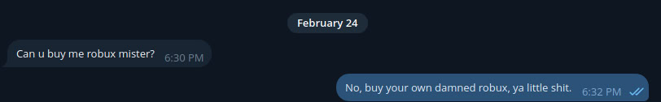

# Blargh

I'm Chris DeBoy, and I write code sometimes.  

I like C/C++, Nim, Ayn Rand, simple solutions/programs, permissive licenses, and game development.  

I dislike JavaScript, XML, socialism, copyleft licenses, cmake, and desktop programs built on any web technologies.  

If I could meet any famous person, alive or dead, I would pick Immanuel Kant so I could kill him personally.  

As an advocate for 0-IP, all information I've created that you see here is released into the public domain, with CC0 and 0BSD licenses available as options in case you live in a jurisdiction that does not recognize public domain.

No, I will not buy you robux.
